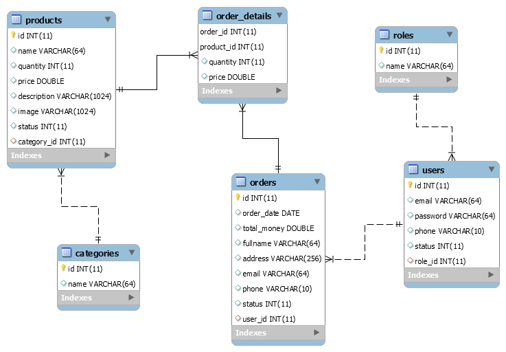
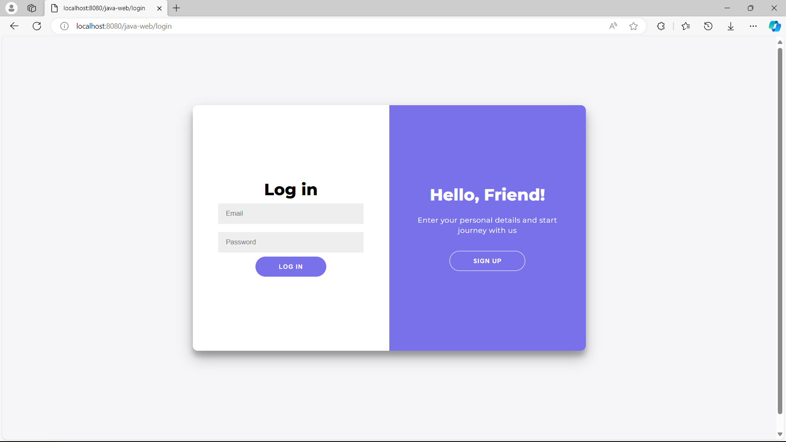
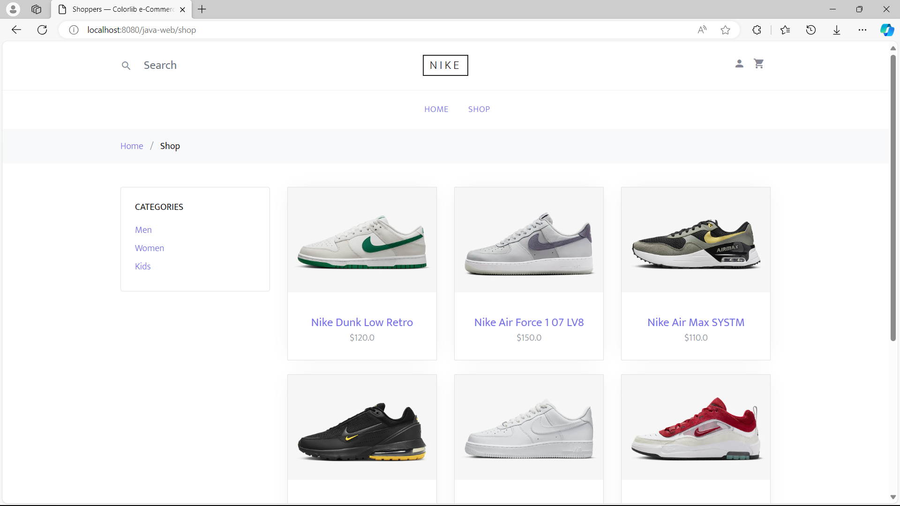
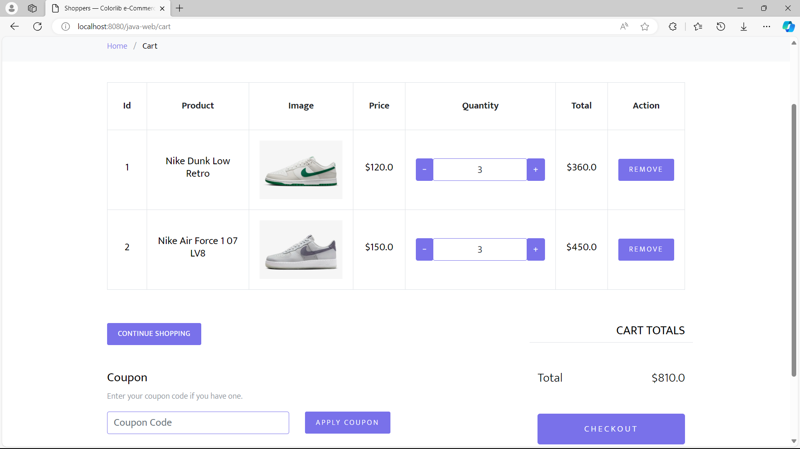
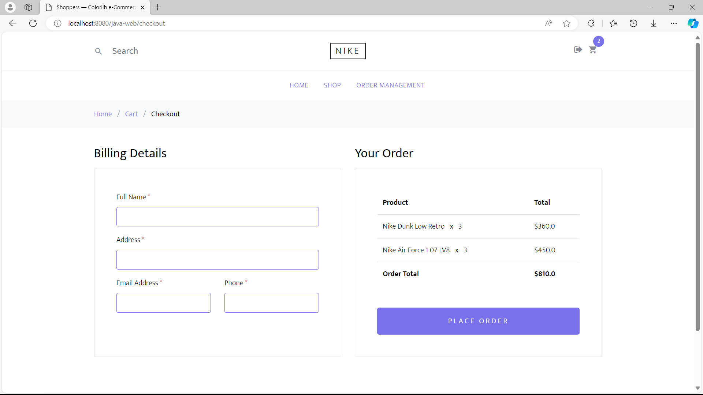
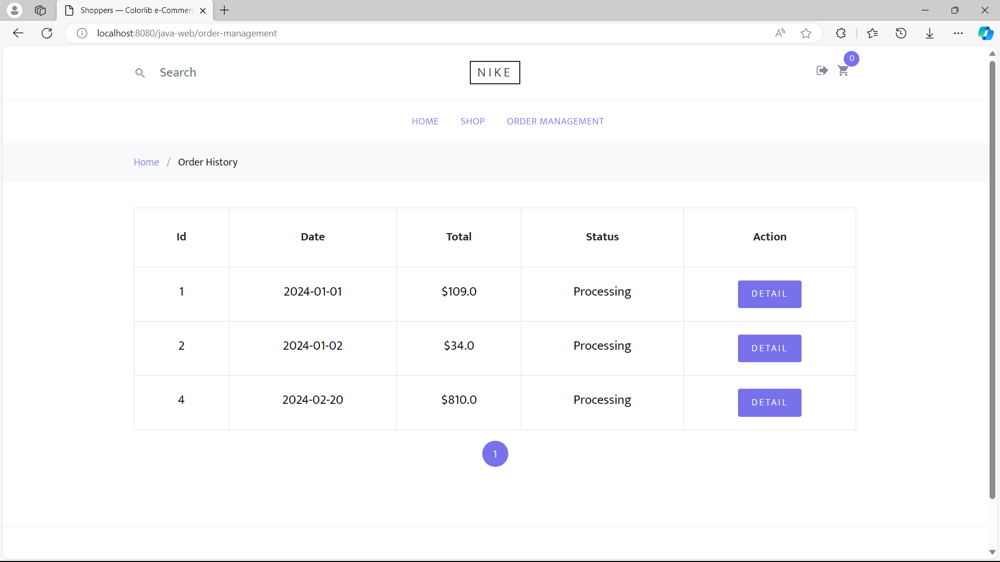
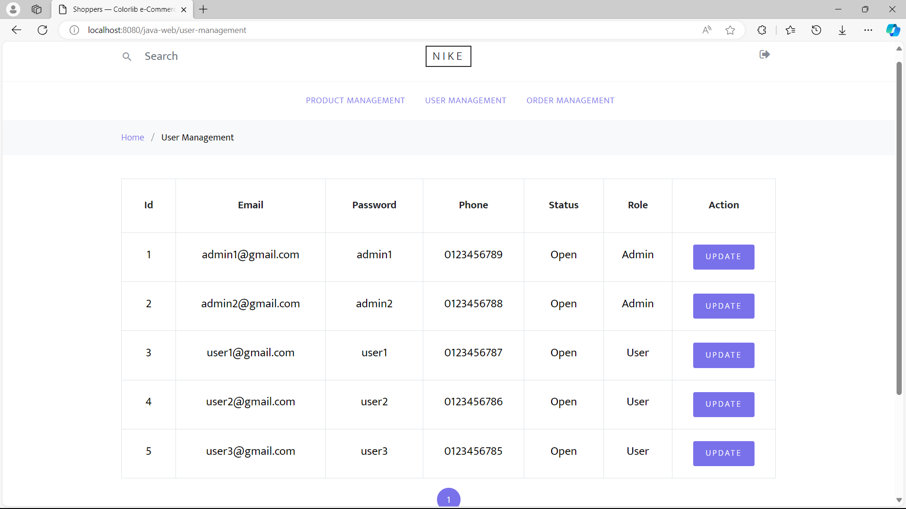
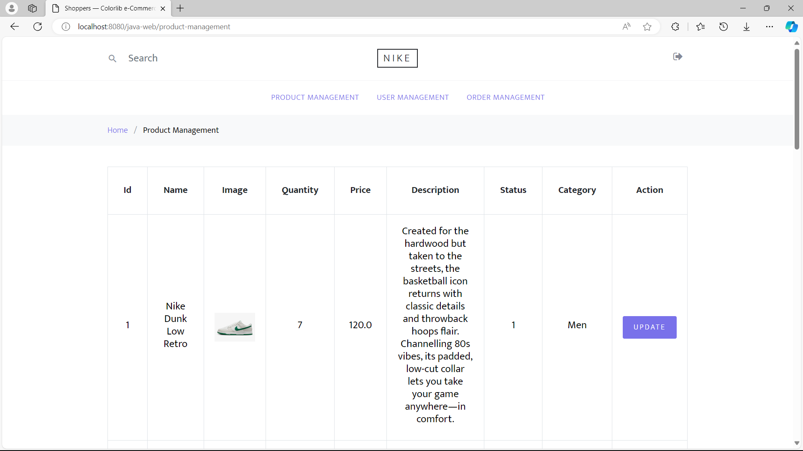
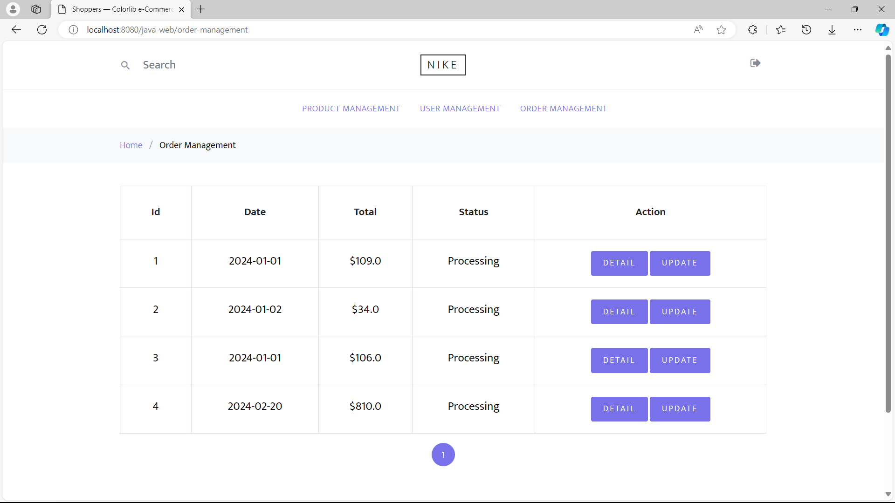

# Online Shopping Website

## Description


## Features
### User features
```
1. Login, logout, and registration.
2. Search and filter items.
3. Store shopping cart using cookie.
4. Add items to shopping cart.
5. Manage items in shopping cart.
6. Checkout.
7. View order history.
6. Pagination.
```

### Admin features
```
1. Login, logout
2. View, add, and edit product (change status of product).
3. View, and edit user info (change status of user).
4. View, and edit order (change status of order).
5. Pagination.
```

## Database design


## Screenshots (detail in images folder)
- Login

- Register

- Shop

- Shopping cart

- Checkout

- Order history

- User management

- Product management

- Order management


## Installing
```
1. Execute db-script.sql
2. Execute data-script.sql
3. Use Tomcat and compile to generate WAR file.
```

## Built with
* [Java](https://www.oracle.com/java/technologies/) - Java jdk 8u191
* [MySQL](https://www.mysql.com/) - MySQL 8.0.13
* [Maven](https://maven.apache.org/) - Maven 3.6.0
* [Tomcat](https://tomcat.apache.org/) - Tomcat 8.5.34
* [Shoppers - Free Bootstrap 4 HTML5 e-commerce website template](https://themewagon.com/themes/free-bootstrap-4-html5-ecommerece-website-template-shoppers/) - Website front-end

## Author
* **Nguyen Minh Khoa** [Github](https://github.com/nmk1406)
